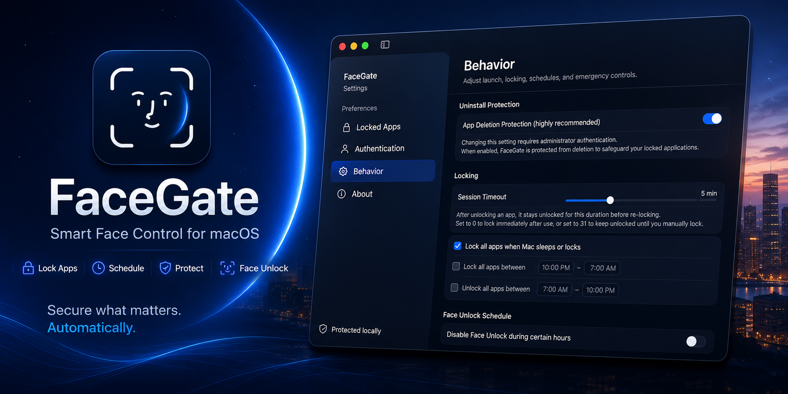

<p align="center">
  
</p>

<h1 align="center">FaceGate</h1>
<p align="center"><em>Application-level locking with on-device face recognition for macOS. Stronger than any other Mac app-locker.</em></p>

<p align="center">
  
  
  
  
  
  
  
</p>

<p align="center">
  
</p>

<p align="center">
  <a href="https://dweep-desai.github.io/FaceGate-web/" target="_blank" rel="noopener noreferrer">
    
  </a>
</p>


FaceGate is a native macOS open-source applocker that brings FaceUnlock to your Mac. Lock sensitive applications behind FaceUnlock, Touch ID, or a secure password — all processed entirely on-device with zero telemetry.

macOS natively lacks the ability to restrict individual applications. Although other App-lockers exist, none of them use face recognition and are not as feature rich as FaceGate. 

All controls in your hands - 100% free & open source , 100% malware free , 100% local . 
<br>
<br>

## Features

- **App Locking** — Lock any installed app. FaceGate intercepts launches in real-time and prevents access until authenticated.
- **On-Device Face Recognition** — Software-based face embedding pipeline running entirely on your Mac via the Apple Neural Engine. No cloud, no data leaving your device.
- **Multi-Face Enrollment** — Enroll up to 3 different faces or alternate looks.
- **External Camera Support** — Use an external USB webcam instead of the built-in camera.
- **Liveness Detection** — Head-pose challenges (turn left, turn right, tilt) to prevent photo and video spoofing.
- **Touch ID** — Seamless integration with macOS Touch ID.
- **Password** — Encrypted PIN stored in the macOS Keychain.
- **Per-App Session Timers** — Customizable unlock duration per app, with timer modes: count from last unlock or from when the app loses focus. Includes "Keep Unlocked Indefinitely" and "Lock immediately"
- **Lock-on-Sleep** — Automatically lock all apps when your Mac sleeps or the screen locks.
- **Uninstall Protection** — Prevents casual deletion by making the app bundle immutable and requires Admin Privileges to uninstall.
- **Scheduled App-Lock/Unlock** — Time-based auto-lock and auto-unlock windows.
- **FaceUnlock Schedule** — Disable face recognition during specific hours (e.g., when dark or in public spaces) to automatically fallback to Touch ID/Password.
- **Auto-Optimization** — Automatically boost display brightness and trigger Center Stage to improve camera visibility and face detection accuracy.
- **Customizable Sensitivity** — Fine-tune face recognition similarity thresholds to balance convenience and security.
- **Menu Bar Control** — Monitor locked/unlocked apps and lock them directly from the menu bar popup.
- **Secure Operations** — Require authentication to quit the application or configure settings to prevent unauthorized tampering.
- **Emergency Kill Hotkey** — Global keyboard shortcut to instantly terminate.
- **Menu Bar Agent** — Runs silently in the menu bar — no Dock icon, no distractions.
<br>

## Demo

<video src="https://github.com/user-attachments/assets/faf3f058-8868-4b76-a880-5b66b208e583" width="100%" controls></video>

<br>


## Installation - Give the repo a ⭐️ so you don't miss future updates.

<p align="center">
  <a href="https://youtu.be/ZBuUl4wp9y0?si=JsenxBQgYtuoPlyb" target="_blank" rel="noopener noreferrer"><strong>▶ Watch the installation video</strong></a>
</p>

### -Recommended: Automatic Install

```bash
curl -fsSL https://raw.githubusercontent.com/dweep-desai/FaceGate-Mac/main/install.sh | bash
```

The script automatically fetches the latest release from GitHub, installs FaceGate to your `/Applications` folder, and removes the Gatekeeper quarantine flag so it can run immediately.

### -Or Manual Install

> [!IMPORTANT]
> FaceGate is not Apple-notarized, so simply double-clicking the manually downloaded app will not work. Follow the steps below:

1. Download the latest `.dmg` from the [Releases](https://github.com/dweep-desai/FaceGate-Mac/releases) page.
2. Mount the DMG volume and drag `FaceGate.app` to your `/Applications` folder.
3. Open Terminal and remove the quarantine attribute by running:
   ```bash
   xattr -cr /Applications/FaceGate.app
   ```
4. You can now launch FaceGate normally!

### -Or Homebrew

```bash
brew install --cask dweep-desai/tap/facegate
```

> ```bash
> xattr -cr /Applications/FaceGate.app
> ```

<br>

## Star History

[](https://www.star-history.com/?repos=dweep-desai%2FFaceGate-Mac&type=date&legend=top-left)

## Security & Privacy

FaceGate is designed as a **convenience layer against casual physical access**, not a defense against targeted attacks using high-fidelity spoofing. The built-in 2D FaceTime camera lacks depth sensing.

- Face embeddings are AES-256-GCM encrypted and stored locally.
- Encryption keys are held in the macOS Keychain.
- The password uses SHA-256 with a random 32-byte salt, stored in the Keychain.
- **Zero telemetry.** The app is fully offline and makes no network requests.
- Face unlock sensitivity is configurable (default similarity threshold: 0.65).

<br>

## Requirements

- macOS 14.0 (Sonoma) or later
- A Mac with a built-in or external camera (for face unlock)
- Touch ID-compatible Mac (optional, for Touch ID fallback)

<br>

## Building from Source

```bash
git clone https://github.com/dweep-desai/FaceGate-Mac.git
cd FaceGate-Mac
brew install xcodegen
xcodegen generate
open FaceGate.xcodeproj
```

Build with `Cmd+B` or `Cmd+R`. You may need to update the signing configuration for your development team.

See [CONTRIBUTING.md](CONTRIBUTING.md) for the complete technical architecture and contribution guide.

---

## License

MIT License. See [LICENSE](LICENSE).

---

<p align="center"><em>Authored by Dweep Desai</em></p>


